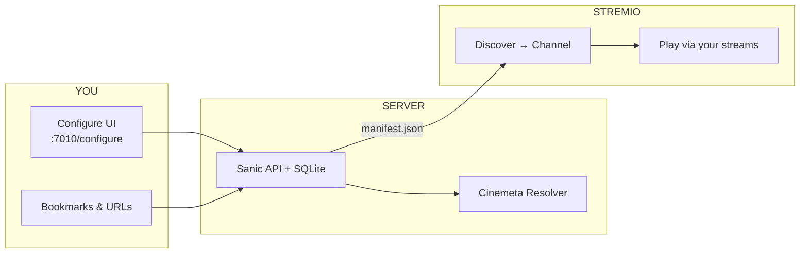

<p align="center">
  
</p>

<h1 align="center">🎬 Channel Organizer</h1>
<p align="center"><strong>Your movie lists. Your rules. Inside Stremio Discover.</strong></p>

<p align="center">
  <a href="#-60-second-start">Start in 60s</a> ·
  <a href="#-how-discover-columns-work">Columns</a> ·
  <a href="#-import-anything">Import</a> ·
  <a href="docs/DEPLOY.md">Deploy</a> ·
  <a href="#-backup--restore">Backup</a>
</p>

---

> **What is this?** A self-hosted Stremio addon that turns curated movie lists into **personal channels** — with a gorgeous configure page, URL importers (Taste of Cinema, Letterboxd, IMDb), and Discover filters for genre, decade, director, and rating.



---

## ⚡ 60-second start

<details open>
<summary><strong>Windows — double-click path</strong></summary>

1. **Run** `run.bat`
2. Open **http://127.0.0.1:7010/configure**
3. Click **New ID** (save it — it's your addon URL key)
4. **Create a channel** → paste a list URL → **Import**
5. Click **Install in Stremio**
6. In Stremio: **Discover → Channel** → pick your list

</details>

<details>
<summary><strong>Manual / dev path</strong></summary>

```bash
python -m venv .venv
.venv\Scripts\pip install -r requirements.txt   # Windows
cp .env.example .env
python main.py
```

Health check: `http://127.0.0.1:7010/api/health` → `"version": "0.5.1"`

</details>

---

## 🧭 How Discover columns work

Stremio shows **~3 dropdown columns** in Discover. This addon maps to them like this:

| Column | What you see | Controlled by |
|--------|----------------|---------------|
| **1** | `Channel` (type) | Stremio |
| **2** | `All` + **your channel names** | Addon catalogs |
| **3** | Genres + **sort shortcuts** (`-90s`, `-Directors`, …) | Addon filters |

### Column 3 sort shortcuts (appear at the top)

Options prefixed with **`-`** sort to the top of the list:

| Pick this | What happens |
|-----------|----------------|
| `-by release date` | Newest → oldest |
| `-Directors` | A→Z by director |
| `-90s`, `-80s`, … | Only movies from that decade *(only decades you actually have)* |

> Director / decade / rating may also appear in Stremio's **All Filters** modal depending on your client version.

---

## 📥 Import anything

| Source | Example | Pagination |
|--------|---------|------------|
| **Taste of Cinema** | [Psychopath movies](https://www.tasteofcinema.com/2015/30-great-psychopath-movies-that-are-worth-your-time/) | ✅ auto `/1/`, `/2/`, … |
| **Letterboxd lists** | `letterboxd.com/.../list/...` | Single page |
| **IMDb lists** | `imdb.com/list/ls...` | Single page |
| **Bulk paste** | `Blade Runner (1982)` per line | — |
| **Files** | `.txt` / `.md` | — |
| **Backup JSON** | `BackupExample.json` in repo | One-click restore |

Movies resolve through **Cinemeta** (Stremio's public metadata API). Metadata backfill runs automatically in the background.

---

## 🗂️ Backup & restore

**Export:** Configure page → **Export backup** → `channels-backup-{userId}.json`

**Import:** **Import backup** → pick JSON → channels appear instantly.

Try the included sample:

```
BackupExample.json   ← 230 curated lists from real bookmarks (Taste of Cinema, etc.)
```

---

## 🏗️ Architecture

```
packages/stremio_playlists/
  addon/        manifest, catalog, filters, sort shortcuts
  importer/     URL scrapers + pagination
  resolver/     Cinemeta lookup
  worker/       import queue + metadata backfill
  db/           SQLite
web/            Configure UI (glassmorphism)
scripts/        bookmark → backup builder
tests/          pytest
```

---

## 🔧 Configuration

Copy `.env.example` → `.env`:

| Variable | Default | Purpose |
|----------|---------|---------|
| `HOST` | `127.0.0.1` | Bind address |
| `PORT` | `7010` | Server port |
| `BASE_URL` | `http://127.0.0.1:7010` | Manifest URLs |
| `API_TOKEN` | *(empty)* | Lock down API on public deploy |

---

## 🌐 Deploy publicly

| Mode | Configure UI | Addon API | Guide |
|------|--------------|-----------|-------|
| **Local** | `run.bat` | `127.0.0.1:7010` | Default |
| **GitHub Pages** | Static `web/` | Still needs your server | [docs/DEPLOY.md](docs/DEPLOY.md) |
| **VPS + tunnel** | Pages or local | ngrok / Fly / Railway | [docs/DEPLOY.md](docs/DEPLOY.md) |

**Install URL format:**

```
http://YOUR_HOST:7010/{your-user-id}/manifest.json
```

---

## 🧪 Tests

```bash
PYTHONPATH=packages python -m pytest tests/ -q
```

---

## 📜 License

MIT — use it, fork it, channel your chaos.

<p align="center"><sub>Built for people who collect lists instead of watching the movie.</sub></p>
